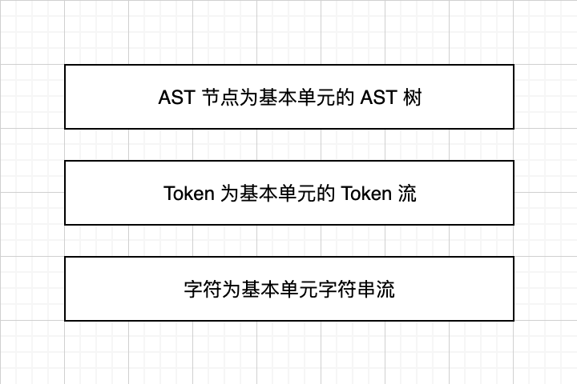
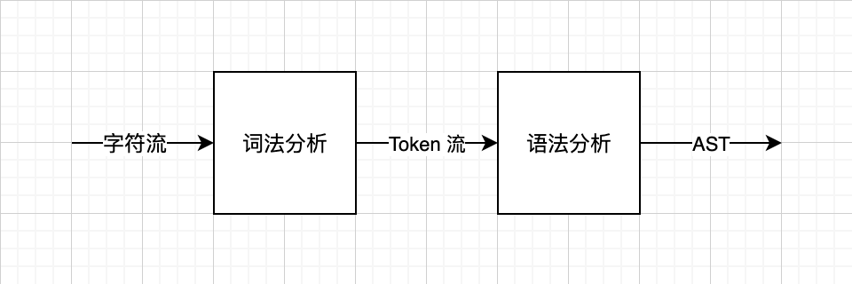

# 第0章、 前置知识

## 索引

[TOC]

工欲善其事，必先利其器。在我们开始制作求值器之前，我们先需要学习一些基本的词法分析、语法分析基础和 JavaScript 最有名的 Parser Generator —— Jison。在学习完本章知识以后，我们应该能够对词法分析和语法分析有一个基本的印象，以及最重要的是能够通过使用正则表达式与 BNF 规则通过 Jison 来生成编程语言的语法解析器（Parser）。

在此，我们本节会对本章所讲的内容做一个概要性的介绍和讲解。

## 编程语言与代码

大部分编译原理的教材都是从词法分析和语法分析开始，然而教材章节设置的原因要从编程语言和代码是什么讲起。

说起语言，我们往往会把它们大致分成两类。一类是我们平时说话写文章的语言，我们把它们称之为自然语言。自然语言的特点是语法规则往往约定俗成、结构松散。另一类就是像我们使用的编程语言这样的形式语言。形式语言的特点跟自然语言相对，语法规则往往有确定并且严格的规则并且无歧义。

我们举一个自然语言常见的例子：「研表究明，汉字的序顺并不定一影阅响读」。这句话的语法和词序完全混乱却并不影响它传达的意义，这是因为人在用自然语言交流过程中有很强的容错脑补能力，但同时自然语言的歧义同样容易在交流中引起误会。而我们的计算机并没有像人这么强大的理解能力，并且我们也希望计算机能够严格按照我们给他制定的流程高效无误地执行，并严格完成我们期望的目标。所以计算机科学家和工程师们人为的制定了一套严谨的形式语言用语，这就是编程语言。

编程语言规定好了一套关键字和语法规范，那么人按照这个语法规范编写的就叫做代码。代码一般是用文本文件保存，内容就是一大串字符，并不能直接运行，因为计算机即便是连结构严谨无歧义的编程语言一样没办法看懂，只能通过编译器或者解释器翻译给计算机。区别是编译器只做纸面文件翻译，做成文件告诉计算机，而解释器做的是同声传译，由解释器代理指挥计算机工作。

> 小贴士：代码是用语给开发者阅读、编写和维护的。在非性能瓶颈或者极端性能场景，代码的逻辑清晰结构清晰比执行效率资源消耗重要得多。

## 词法分析与语法分析

我们前面讲了计算机无法直接看懂我们编写的代码，需要解释器和编译器进行翻译，那看懂代码这个问题就从计算机的身上转移到了解释器和编辑器的身上。而解释器和编辑器用词法分析器和语法分析器来读懂由开发者编写的代码别转换成计算机初步能读懂的抽象语法树（AST）这种数据结构。

我们在解决解析器读懂代码时会分成词法分析和语法分析两个步骤。词法分析负责分词，就是将文本字符串切割成语法分析能够是别的最基本单元 Token。语法分析则负责接受 Token，并且分析语法并且累积成抽象语法树（AST）。

分析器将词法分析和语法分析分离其实是因为在处理不同抽象层次的问题。整个代码解析的过程分成了三个抽象层次。以字符为基本的单元的字符串流、以 Token 为基本单元的 Token 流和以 AST 节点为基本单元的 AST 树。如果不理解流的话可以暂时理解为数组，在后面会有更详细的介绍。这三个层次从低到高颗粒度越来越粗，抽象层次也越来越高，其实也表达了在计算机眼中代码所蕴含信息的三个不同维度。

> 小贴士：分层是非常常见的设计思想，小至几行代码几个函数怎么设计，大致大的系统大家的架构，都能应用上分层的思想。像 MVVM 、 MVC 等层次架构就是分层思想的典型例子。将问题分层是是常用的设计思想，将问题分层有两个好处：一、可以将问题分解成多个不同层次相对小的问题分治处理；二、可以将不同层次解藕，并且可以随意更换一层重构，或者分配个不同开发者而不容易相互影响。

分层会影响运行效率吗？看上去把解析分成两个步骤貌似需要更多的内存消耗和更多的扫描次数？然而实际上整体的影响非常小，这得益于我们上面提到的流这个词。一个正常的分析器实际上都是流式的分析，当从文件里面读出一个字符（或者一行），我们会立刻将这部分字符数据作为词法分析器的输入。而词法分析器在得到输入后立刻进行解析，如果能解析得到 Token 就立刻输出并作为语法分析器的输入进行解析。在流式的结构中，代码实际字扫描了一遍，并且词法分析所缓存的 Token 只需要保持一个即可，多余的已经进入语法分析起进行分析，所以流式的结构自始至终都不会产生明显的多余性能和内存的消耗。

>  小贴士：流的思想是计算机界里面一个非常重要的思想。在 JavaScript 界里面常见的应用场景如 Node 的 Stream，以及 Rxjs。有一个很大的误区就是 Rxjs 是用来处理异步的，虽然说他处理异步确实是 Rxjs 的主要应用场景，但是准确来说它不仅仅是处理异步的，而是处理流的，恰好这些数据时来自于异步，所以表面上它成了一个处理异步的工具。正常的流式架构时根本不在乎什么同步异步、单线程多线程甚至不在乎你是单机还是集群。

但在本书里面，词法分析和语法分析部分只会在前置知识这章内迅速讲完，并不会深入讲解。编程语言的词法分析语法分析在一个编程语言里面是难点但不是重点。难点是因为需要迁就人编写和阅读的便捷性，而对编程语言的核心不会有任何影响。举个例子，比如 Lisp 的语法就是非常简单，一个简单的 Lisp 元循环解释器仅仅只有百来行代码，并经常成为国外一些大学的入门课程的课程作业。而作为代价的就是 Lisp 广受诟病的括号以及前缀式表达式。而另外一个极端的例子是纯函数式编程语言 Haskell，它为了让编写代码的过程跟贴合数学表达式，甚至可以自定义中缀运算符以及其优先级，但是代价是 Haskell 的语法解析异常复杂和困难。

> 小贴士：中缀式表达式就是我们常见的把运算符号放在中间的表达式，前缀式是把运算符号放在前面的表达式。比如中缀式表达式 `1 + 2 * 3`  对应的前缀式表达式是 `(* (+ 1 2) 3)` 。在语法分析的时候，由于语法分析起一般都是从左向右扫描，对运算符号的优先级和结合性等处理处理起来都很复杂。

我们常用的编程语言语法则处于 Lisp 和 Haskell 的复杂度之间，既没有 Lisp 那么简单但是难用，也没有 Haskell 那么复杂。所以我们并不需要深入学习各种复杂的算法，只需要学习基本的 Parser Generator 工具就足够我们的 JavaScript 解释器之旅。

## Jison 简介

如前面所说，Jison 是 JavaScript 界最出名的 Parser Generator，它跟 Bison（C/C++） 相似可以通过正则和上下文无关文法自动生成一个 LALR(1) 算法的分析器，同时也支持 LR(0)， SLR(1) 以及 LR(1) 算法。

Jison 可以通过正则表达式自动生成词法分析器，正则我们默认所有会 JavaScript 的同学都已经掌握基础的正则表达式基础。Jison 在正则上面扩展了声明变量，可以更方便地复用一段正则片段。在这个基础之上，Jison 在为分词加多了一个状态栈，从而可以更方便地解析注释和多行字符串等。由于 Jison 语法可以内嵌 JavaScript，所以可以用所有 JavaScript 的能力和技巧，在接下来的章节内会详细介绍。

和词法分析类似 Jison 可以根据CFG（上下文无关文法）自动生成语法分析器，我们需要用 BNF （巴克斯-诺尔范式）来表示上下文无关文法。Jison 可以自己选择左递归或者右递归，并且为了更方便的处理表达式，Jison 还提供了提前声明运算符结合性和优先级的标识用于方便表达式 CFG 的声明。

到此 Jison 的简介已经结束了，但是却留下了很多让大家不明所以的的名词，比如 CFG、BNF、左递归等不说人话的名词。这些名词听上去高大上，事实上这些唬人的名词也只是纸老虎而已，在接下来的章节我们会用人能听得懂的方法来讲解词法分析和语法以及 Jison 的使用，并且在本章的最后会有一个比较复杂的应用实例。Jison 是我们这个章节的重点内容，同时 Jison 也会在整本书内承担所有的解析工作。