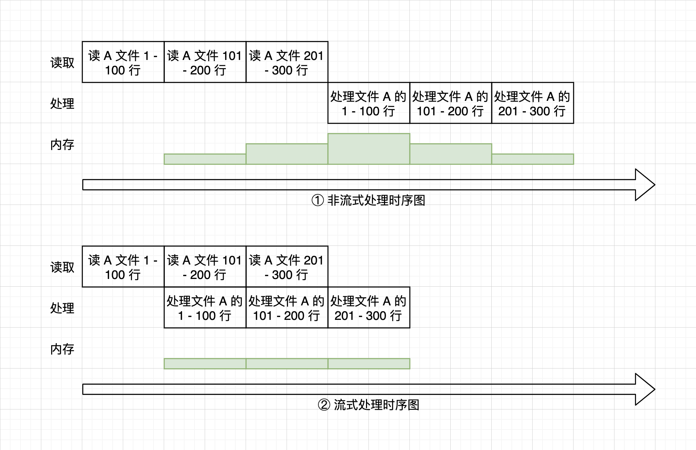

# 第0章第1节、词法分析

## 索引

[TOC]

## 词法分析器的输入输出

>  你站的越近，看到的就越少。  —— 电影《惊天魔盗团》

在开始了解词法分析之前，我们先把词法分析当成一个黑盒忽略所有内部实现细节，然后看看一个词法分析器到底输入和输出 —— 字符流和 Token 流。


正式开始讲输入输出之前，我们先讲讲流。从表面上看我们读一个文件或者处理一个网络请求，是一次性全部到达内存成为一个对象，让程序可以操作。然而显而易见这是不可能的，正常情况下的 IO 都是一部分一部分到达计算机内存直到全部数据到达，当全部到达以后才能开始处理。

如下图所示，假设下图一个步骤是 1t ，A 文件一百行所占内存为 1m，读取 A 文件 100 行储存至内存内存上升 1m，而当处理完 100 行文件以后，这 100 行文件的内存释放 1m。

假设我们有一个 300 行的文件，我们需要写一个程序来处理这个文件。按照我们一般非流失的处理方式，我们会先完全读完这个文件，然后再处理。如下图 ① 所示，总共会用 6t 时间，峰值最多会占用 3m 内存。而如图 ② 所示的流式处理在整个处理过程中总共花了4t 时间，峰值占用内存 1m。从图上可以看出，我们读取文件和处理文件花费的时间并没有减少，仅仅只是将两个任务的时间错开便提了高效率降低资源消耗。

> 小贴士：不要被 JavaScript 的单线程异步事件模型所误导以为 JavaScript 引擎只有一条线程。事实上 JavaScript 的单线程是指 JavaScript 引擎在任何时间有且仅有一条线程在执行 JavaScript 代码，但是其他 IO 比如网络、文件、浏览器渲染等都会用自己独立的线程执行，这些线程通过异步事件跟执行 JavaScript 代码的线程进行通信。



如果有一个数据源，如果数据没有一次性全部给你，而是按照时间顺序一段一段给你，那么这就是一个流。一个架构的输入输出并不是一次性全部给你，而是输入的流来多少数据我就处理多少，能输出多少就给你多杀，那么这就是一个流式架构。

> 小贴士：流的思想运用广泛，流水线（Pipe Line）、管道过滤器（Filter Pattern）、MapReduce 架构都是流式思想的应用。

同理我们的一个词法分析输入输出都是流，输入是字符流，就是指代码文件并不需要一次性全部输入，而是可以以字符为最小单位一个个或者一段段输入，有多少就可以往这个词法分析器里面输入。而输出是 Token 流，就是指并不需要一次性把词法分析出的 Token 全部输出，而是有多少就输出多少。

现在只剩下最后一个 Token 这一个名词还没有作讲解，那么在讲解 Token 是什么之前，我们先看一看一个词法分析器内部是怎么运作的。


## 词法分析器是如何运作的

下图是一个词法分析器的一个简单结构示意图，并且这个词法分析只能处理 `CONST` `NUMBER` `IDENTIFY` `=` 四种符号。词法分析器会把输入的字符一个接着一个输入状态机，当状态机会根据输入的分析直到它达到某一个可以接受的状态，于是便输出了一个 Token。这个 Token 包含最终状态机的接受状态，比如我们下面的词法分析有  `CONST` `NUMBER` `IDENTIFY` `=` 四个接受状态，这是 Token 里面最重要的信息之一，也就是我们前面所称为的符号，他的作用是给之后语法分析器用的。另一个最重要的信息是词法分析器分析出一个 Token 时捕获的字符串，这不涉及语法但是决定之后程序如何执行的必要信息。

比如我们给词法分析器输入字符串 `const abc = 123`，当输入到 `const` 的时候，状态机会输出 `CONST` Token，当输入 `abc` 的时候，状态机输出 `IDENTIRY` 并捕获字符串 `abc` ，同理最终我们会得到 `CONST IDENTIFY = NUMBER` 这样的 Token 流。状态机在遇到文件的末尾时，会输出一个 `EOF` Token 用于表示词法分析和语法分析的末尾。

状态机具体的工作原理我们就不在这里具体展开讲了，它本质上是一个正则引擎，只需要记住它能接受字符的输入然后改变状态，当状态变为接受状态的时候就表示可以产生一个 Token 了。


词法词法分析器本质上就干了两个工作：

1. 找到字符串的断点，捕获字符转换成我们需要的类型
2. 为这段字符标上一个对应的符号（终结符）

> 小贴士：在学习的过程中找事物的本质有利于站在更高的层次找准学习的方向和目标，但是只追求本质不深入学习细节就夸夸而谈反而是有害的。举个例子，我们都知道深度学习本质上就是拟合一个函数，但是学习深度学习的重点和难点并不在于知道神经网络是在拟合函数，而是怎么去拟合这个函数。所以使用 XXX 本质上不过是 XXX 去抨击一个自己不熟悉的领域是一种非常自大且冒犯的行为。

## 


## 准备环境

到此理论部分已经结束，可能对于很多朋友来说理论过于枯燥和晦涩，接下来我们直接进入实战。首先先开始搭建我们的基础环境。

我们默认大家的开发环境已经有 git / node / npm 了。（思考一下要不要

先克隆我们需要准备的环境，这是一个已经搭建好的 Vue 环境，选择 Vue 环境是能够让更多的人能够更快上手并且更多的关注我们的 JavaScript 解释器的构建，所以我们尽量降低入手门槛，让大家把更多的精力放在事物的关键。

我们

```bash
git clone https://github.com/OverWatcherX/javascript-interpreter.git
cd javascript-interpreter
npm install
npm run serve
```


然后打开浏览器：输入 `http://localhost:808` 便可以跑起来我们的测试环境。


## 开始我们的第一个词法分析器


## Jison 常用词法解析技巧

1. 分析缩进 `this.uninput` 


## 实战：简易配置文件解析器

